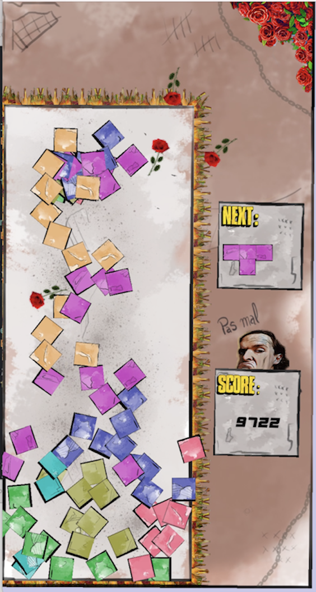

# TN-Tetris

TN-Tetris is a desktop game powered by the Simple Fast Multimedia Language ([SFML](https://www.sfml-dev.org/)). It's Tetris, but with extra explosive effects when rows are completed. Fans of certain modern games may recognise where we got our inspiration from.
This project was built by 2 amateur indie game developpers wanting to learn more about the fascinating world of building video games. 

*   Development, code & voice overs:
[Marc-Antoine Lacroix](https://www.linkedin.com/in/marcantoinelacroix/)

*   Art & design:
[Johnny Khalil](https://www.linkedin.com/in/johnnykhalil/)



*   Music:
[Tri-Tachyon & Alexandr Zhelanov - Opengameart.org](https://www.opengameart.org)

## How to play

*   Arrows: move pieces
*   Spacebar: start game & rotate piece
*   P key: pause the game
*   R key: reset the game

## How to install on a Mac

Here are the general instructions how to compile and run the game. Note that if you are installing it on a Mac, you may run into a number of security checkpoints. Unfortunately we cannot guarantee the installation will go as smoothly as described below. This application has not been tested on a Windows or a Linux machine yet. 

**1. Download or clone this repo**

**2. Get SFML using Brew with this command:**
````brew install sfml````

**3. Open a new Terminal and go into the 'game' folder**

**4. Compile and run with this command:**
````g++ -std=c++17 *.cpp -F/Library/Frameworks -framework sfml-audio -framework sfml-graphics -framework sfml-window -framework sfml-system -o tntetris && ./tntetris````

## How to install on a Windows machine

Instructions coming soon